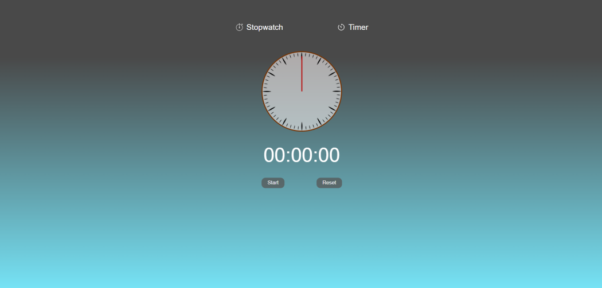
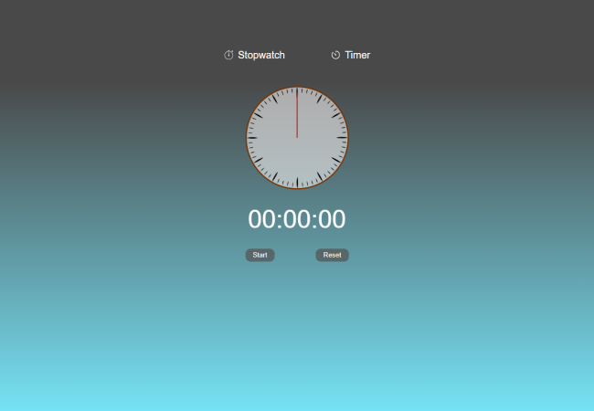
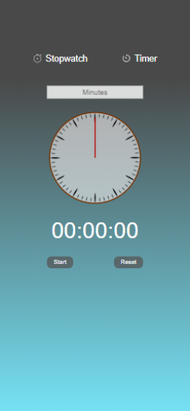

# Stopwatch / Timer MVC

### Description

*This is pet-project about web-application - Stopwatch / Timer.* 
 
In this web-app you can choose what you need - Stopwatch or Timer. Also, you can set your timer, stop and reset it. The same with stopwatch.
 
During this pet-project I used HTML, CSS *(Flexbox)*, JavaScript *(MVC architecture and OOP-principles)* languages and tools.
This web page is fully adaptive for all devices. Below you can see screenshots of desktop, tablet and mobile versions.

### Preview

 
